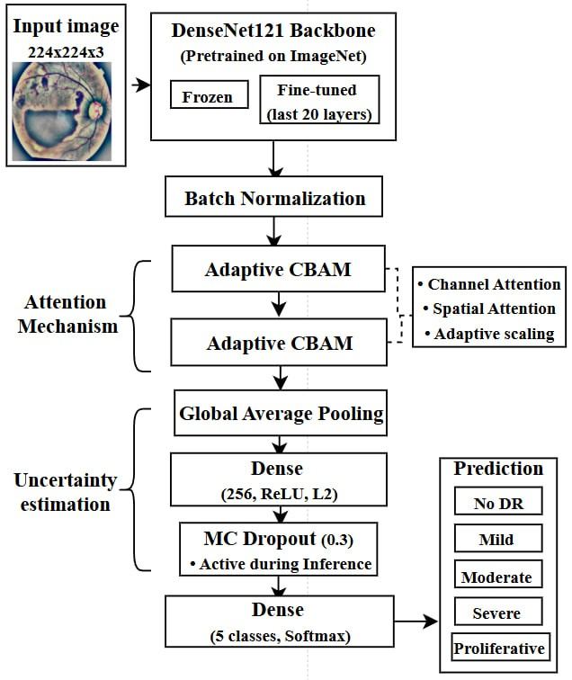
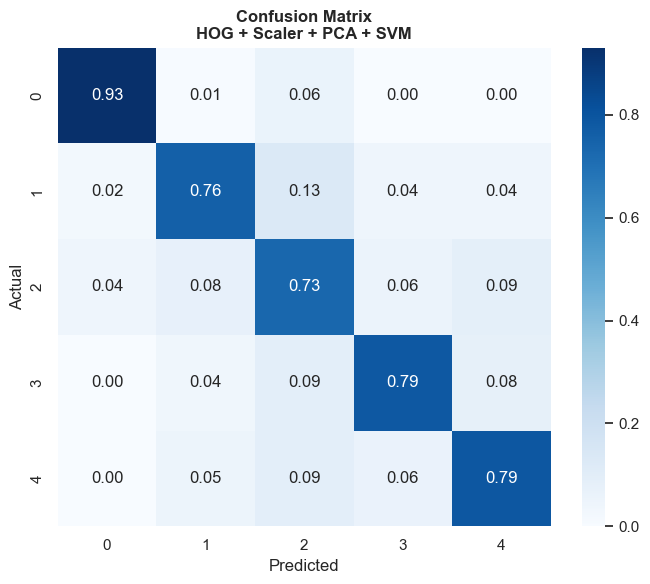
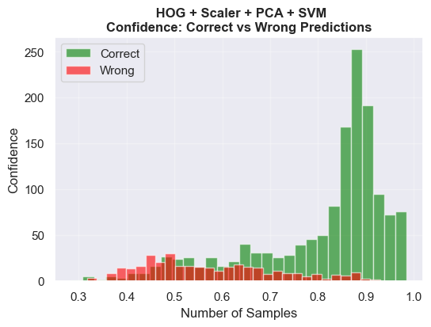
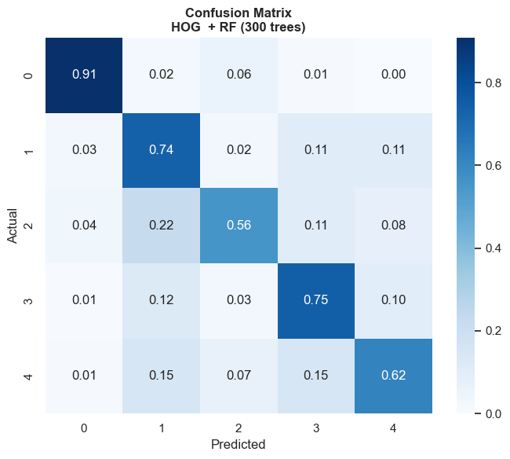
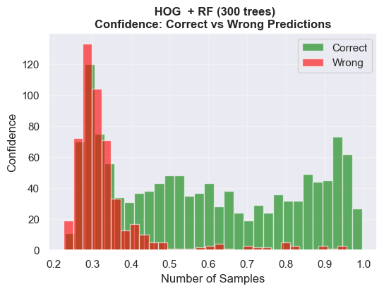
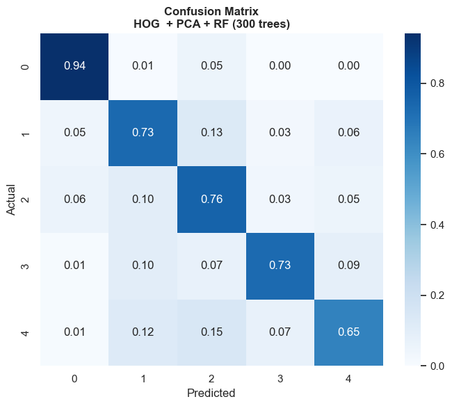
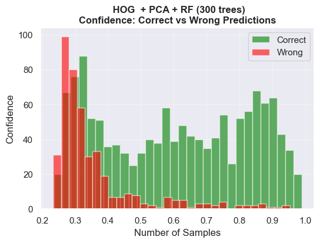

# Comparison of HOG-based Classical Classifiers and CNN Models for Diabetic Retinopathy Diagnosis

## Overview
This repository contains materials for the research paper:
**"Comparison of HOG-based Classical Classifiers and CNN Models for Diabetic Retinopathy Diagnosis"**  
DOI: 

This study performs a comprehensive, confidence-aware comparison between HOG-based classical classifiers (SVM, RF) and a CNN architecture incorporating Focal Loss, Adaptive CBAM attention, and Monte Carlo Dropout. The CNN architecture was developed in the previous study.

---

## Authors
- **Yelizaveta Kabanova**  
  ORCID: https://orcid.org/0009-0001-2692-5066  
  Email: yelizavetakabanova@gmail.com  

- **Nataliia Kuznietsova**  
  ORCID: https://orcid.org/0000-0002-1662-1974  
  Scopus Author ID: 56412465200  

- **Kateryna Ivanko**  
  ORCID: http://orcid.org/0000-0002-3842-2423  
  Scopus Author ID: 55819298100  

- **Vishwesh Kulkarni**  
  ORCID: https://orcid.org/0000-0002-22858652  
  Scopus Author ID: 7201425741  

---

## Citation
If you use this work, please cite:

> Kabanova Y. I., Kuznietsova V. N., Ivanko K., Kulkarni V.  
> “Comparison of HOG-based Classical Classifiers and CNN Models for Diabetic Retinopathy Diagnosis”.  
> Computer Modeling and Intelligent Systems (CMIS-2026), May 05, 2026, Zaporizhzhia, Ukraine
> DOI: 

---

## Abstract

This work addresses diabetic retinopathy (DR) classification with a focus on predictive reliability and confidence estimation. 

A comprehensive comparison is conducted between classical machine learning models (SVM, Random Forest) based on HOG features and a deep learning model based on DenseNet121 with Focal Loss, Adaptive CBAM, and Monte Carlo Dropout.

The results highlight that model reliability is as important as accuracy in medical imaging, and demonstrate that uncertainty-aware deep learning provides robust diagnostic support, while classical approaches remain useful in resource-constrained settings.

---

## Methodology

This study follows an experimental pipeline designed to ensure a fair comparison between classical machine learning and deep learning approaches for diabetic retinopathy classification. The workflow consists of four main stages: image preprocessing, class balancing and data augmentation, model training, and confidence-aware evaluation.

---

## Scientific contributions 
- A unified evaluation framework for a fair comparison under identical preprocessing, balancing, and training conditions.
- Extension of uncertainty analysis from Monte Carlo Dropout–based estimation to confidence–correctness alignment metrics (AURC, E-AURC).
- A reliability-centered interpretation of model behavior in diabetic retinopathy classification across fundamentally different learning paradigms.

---

### Data
- Dataset: APTOS 2019 Blindness Detection (Kaggle).
- 5 classes (DR stages: 0–4).

---

### Experiments

**1. Classical ML: HOG Features**
- Feature extraction: Histogram of Oriented Gradients (HOG)
- Classifiers:
	- SVM with RBF kernel, One-vs-One strategy;
	- Random Forest (RF) with 200–500 trees, with/without PCA;
- Dimensionality reduction: PCA (160 components selected).
**2. Deep Learning: CNN**

---

## Evaluation Metrics

- Classical metrics: Accuracy, Precision, Recall, F1-score, AUC, Quadratic Weighted Kappa (QWK).
- Confidence-aware metrics:
	- AURC (Area Under Risk–Coverage Curve);
	- E-AUROC (Error-Aware ROC);
	- Confident Separation.
- Confidence for each model calculated using predictive probabilities.

---

## Key Results
 
| Model                     | QWK   | Accuracy | F1-score | AUC   | AURC  | E-AUROC | Mean Confidence |
|--------------------------|-------|----------|----------|-------|-------|---------|-----------------|
| HOG + SVM                | 0.851 | 0.799    | 0.800     | 0.930 | 0.054 | 0.862   | 0.76           |
| HOG + RF (300 trees)     | 0.739 | 0.713    | 0.712    | 0.924 | 0.108 | 0.817   | 0.519           |
| HOG + PCA + RF (300)     | 0.784 | 0.761    | 0.761    | 0.937 | 0.084 | 0.828   | 0.545           |
| CNN (DenseNet121)        | 0.922 | 0.856    | 0.855    | 0.979 | 0.033 | 0.840   | 0.75            |

**Key observations:**
- CNN achieves the highest performance and best uncertainty reliability (lowest AURC).
- SVM provides strong confidence–error separation despite lower accuracy.
- PCA improves Random Forest but does not close the gap with SVM and CNN.

---

## Additional Results

In addition to figures presented in the paper, this repository includes extended experimental outputs for each configuration:

- Confusion matrices. 
- ROC-AUC curves.
- E-AUROC.
- Confidence distributions (correct vs incorrect predictions)

---

### Files:
- `hog_results.csv` — classification and uncertainty etrics.

---

## License

This project is shared for research and educational purposes.
